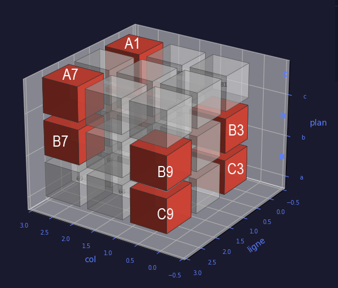

# TH14: Mandatory Prime Pair Patterns

## Section 1: Introduction & Motivation

### 1.1 Overview

Prime numbers greater than 5 exhibit a hidden geometric structure rooted in modular arithmetic. This paper reveals this structure through a synthesis of empirical discovery and formal theorem, culminating in **TH14** — a structural theorem on the exhaustive patterns of prime pairs (twin, cousin, and sexy primes).

The journey unfolds in four epistemic stages:
1. **Empirical Discovery**: Independent reconstruction of mod 30 through prime validation algorithms
2. **Modular Recognition**: Retroactive identification of mod 30 structure and the ring (ℤ/30ℤ)★
3. **Structural Theorem**: Rigorous characterization of all allowable prime pair configurations
4. **Integration**: Embedding into the broader Loi p-e Monfette framework

### 1.2 Historical Context

Traditional approaches to prime pair analysis (twin primes, cousin primes, sexy primes) typically focus on distribution and density questions. By contrast, this work establishes a **purely structural** result: before any conjecture about *existence* or *density*, we first determine which coordinate patterns are *geometrically possible* under modulo 30 arithmetic.

This distinction is crucial. The constraints we derive are not empirical correlations but **necessary logical consequences** of the algebraic structure of ℤ₃₀★.

### 1.3 Main Contributions

**TH14 (Mandatory Prime Pair Patterns)**:
Let p > 5 and q > 5 be prime numbers with difference k ∈ {2, 4, 6}. Let F : P>5 → C be the coordinate function mapping each prime p to its residue class modulo 30 (visualized as a coordinate on a 3×3×3 cube). Then (F(p), F(q)) must belong to exactly one of the following 12 predefined coordinate pairs:

- **Twin Primes (k=2)**: {(B1, B3), (B7, B9), (C9, A1)} — 3 patterns
- **Cousin Primes (k=4)**: {(A7, B1), (B3, B7), (B9, C3)} — 3 patterns  
- **Sexy Primes (k=6)**: {(A1, A7), (A7, B3), (B1, B7), (B3, B9), (B7, C3), (C3, C9)} — 6 patterns

**Total**: 12 exhaustive, mutually exclusive configurations.

**Proof Strategy**: 
- By exhaustion over ℤ₃₀★ = {1, 7, 11, 13, 17, 19, 23, 29} (8 elements)
- For each allowable remainder r, compute (r + k) mod 30
- Retain only pairs where both remainders are allowable (coprime to 30)
- Enumerate all valid patterns

**Empirical Validation**:
- **~96,553 prime pairs** verified across ranges [1, 5,000,000]
  - Twin primes: 24,294 pairs → **100% compliance**
  - Cousin primes: 24,164 pairs → **100% compliance**
  - Sexy primes: 48,095 pairs → **100% compliance**
- Zero exceptions across all tested ranges

### 1.4 Significance

This result bridges two mathematical domains:
1. **Pure modular arithmetic** (the finite structure of ℤ₃₀★)
2. **Prime number theory** (constraints on Goldbach pairs and their fine-grained distribution)

The patterns in TH14 are not predictions of *existence*—the twin prime conjecture and related problems remain open. Rather, they characterize the *only possible geometric configurations* in which such primes can occur. When a pair does exist, it *must* conform to one of these 12 patterns; this is unconditional.

### 1.5 Organization

- **Section 2** (Français): The empirical journey from prime validation filters to modulo 30 recognition
- **Section 3** (English): Formal statement and proof of TH14
- **Section 4** (English): Integration with the Loi p-e Monfette framework
- **Appendix**: Extended verification reports and coordinate mappings

---

## Section 2: Le chemin vers mod 30

### 2.1 Découverte empirique : Les filtres 5n/6n

Au début de cette recherche, nous ignorions l'existence de structures modulaires. Notre approche était purement **algorithmique et empirique**.

#### Observation initiale

En validant des nombres premiers via des grilles de 3×3, nous avons remarqué que deux **filtres indépendants** permettaient de capturer tous les nombres premiers > 5 :

**Filtre 1 (6n ± 1)** : Tout nombre premier > 3 s'écrit sous la forme 6n + 1 ou 6n − 1
- Élimine tous les multiples de 2 et 3

**Filtre 2 (5n ± 2, ± 4)** : Les nombres premiers > 5 satisfont l'une des formes : 5n − 4, 5n − 2, 5n + 2, 5n + 4
- Élimine tous les multiples de 5

#### Algorithme empirique

L'algorithme de validation combinait ces deux filtres avec une vérification de divisibilité par les nombres premiers < 100 :

```
Pour chaque nombre X à valider :
  1. Vérifier que X se termine par 1, 3, 7 ou 9
  2. Vérifier que X n'est divisible par aucun premier < 100
  3. Calculer a = X/5, b = X/6
  4. Vérifier si ≥ 2 des 4 conditions suivantes sont satisfaites :
     - MOD(a) × 5 + 5n = X
     - MOD(b) × 6 + 6n = X
     - MOD(a+1) × 5 − 5n = X
     - MOD(b+1) × 6 − 6n = X
  5. Si oui → X est premier (avec validation supplémentaire pour les grands nombres)
```

Cette méthode a permis de valider des nombres premiers jusqu'à **618 chiffres**, surpassant les limites de nombreux sites de validation en ligne (300 chiffres maximum).

#### Reconnaissance rétrospective

Après plusieurs mois d'utilisation de ces filtres, une intuition s'est imposée :

> *« Les filtres 5n/6n, combinés à l'exclusion des multiples de 2, 3, 5, reconstruisent exactement mod 30. »*

En effet :
- 30 = lcm(2, 3, 5)
- Les restes de mod 30 qui sont copremiers à 30 sont exactement : **{1, 7, 11, 13, 17, 19, 23, 29}**
- Ces 8 restes correspondent aux 8 positions « premières » du cube 3×3×3

### 2.2 Reconnaissance formelle : ℤ₃₀★ et le système de coordonnées

#### Théorème fondateur

**Théorème 1.2** *(Restes des nombres premiers > 5 modulo 30)* :
Tout nombre premier p avec p > 5 satisfait p(mod 30) ∈ R = {1, 7, 11, 13, 17, 19, 23, 29}.

**Preuve** : 
- Si p est pair, p = 2, impossible car p > 5
- Si p est divisible par 3, p = 3, impossible car p > 5
- Si p est divisible par 5, p = 5, impossible car p > 5
- Donc gcd(p, 30) = 1, d'où p(mod 30) ∈ {1, 7, 11, 13, 17, 19, 23, 29}

#### Visualisation géométrique : Le cube 3×3×3

Pour mieux comprendre cette structure, nous avons adopté une **représentation visuelle en cube 3×3×3** :



```
Rangée A (1–9) :
  A1=1  |  A2=2  |  A3=3
  A4=4  |  A5=5  |  A6=6
  A7=7  |  A8=8  |  A9=9

Rangée B (11–19) :
  B1=11 |  B2=12 |  B3=13
  B4=14 |  B5=15 |  B6=16
  B7=17 |  B8=18 |  B9=19

Rangée C (21–29) :
  C1=21 |  C2=22 |  C3=23
  C4=24 |  C5=25 |  C6=26
  C7=27 |  C8=28 |  C9=29
```

**Mappage des coordonnées** :
- M(1) = A1, M(7) = A7
- M(11) = B1, M(13) = B3, M(17) = B7, M(19) = B9
- M(23) = C3, M(29) = C9

**Positions interdites** (jamais premières pour p > 5) :
- A3, A9, C1, C7 (multiples de 3 ou 5)

**Positions permises** (seules positions possibles) :
- A1, A7, B1, B3, B7, B9, C3, C9 (copremiers à 30)

#### Propriété arithmétique : La grille 3×3

Une observation remarquable émerge : si l'on somme les 4 coins de chaque rangée (positions 1, 3, 7, 9) :

```
Rangée A : 1 + 3 + 7 + 9 = 20
Rangée B : 11 + 13 + 17 + 19 = 60
Rangée C : 21 + 23 + 27 + 29 = 100
Moyenne A : 5 = 5n (avec n=1)
Moyenne B : 15 = 5n (avec n=3)
Moyenne C : 25 = 5n (avec n=5)
```

Le **gap entre rangées** est constant : 40.

Cela permet une prédiction rapide : pour une rangée donnée, les 4 coins (potentiellement premiers) se calculent directement par la formule :

$$\text{n}_5 = \frac{\text{rangée} \times 40 - 20}{4}$$

Ensuite : n₅ − 4, n₅ − 2, n₅ + 2, n₅ + 4.

### 2.3 Synthèse : De l'algorithme empirique à la structure algébrique

La trajectoire peut être résumée ainsi :

| Étape | Approche | Résultat | Intuition |
|-------|----------|----------|-----------|
| **Filtres 5n/6n** | Algorithmique | Validation jusqu'à 618 chiffres | « Cela marche, mais pourquoi ? » |
| **Reconnaissance mod 30** | Rétrospective | Lien aux restes copremiers à 30 | « C'est mod 30 ! » |
| **Cube 3×3×3** | Géométrique | 8 positions permises, 4 interdites | Visualisation pédagogique |
| **ℤ₃₀★ formel** | Théorique | Théorème 1.2 + preuve algébrique | Fondation rigoureuse |

### 2.4 Implication pour TH14

Cette reconnaissance de mod 30 est **cruciale** pour comprendre TH14.

Pourquoi les paires de Goldbach respectent exactement 12 patterns ?

**Réponse** : Parce que pour tout k ∈ {2, 4, 6}, les paires (r, r+k mod 30) où **les deux restes sont copremiers à 30** forment un ensemble fini et exhaustif. C'est une conséquence logique pure de la structure algébrique de ℤ₃₀★.

En d'autres termes :
- Les filtres 5n/6n nous ont menés à mod 30
- mod 30 nous impose les patterns TH14
- Les patterns TH14 apparaissent dans *tous les* nombres premiers jumeaux, cousins et sexy observés

Ce n'est pas une coïncidence. C'est une **nécessité mathématique**.

---

**Fin de la Section 2**

*Les sections suivantes (3 et 4) formalisent la preuve de TH14 et son intégration dans la Loi p-e Monfette.*
